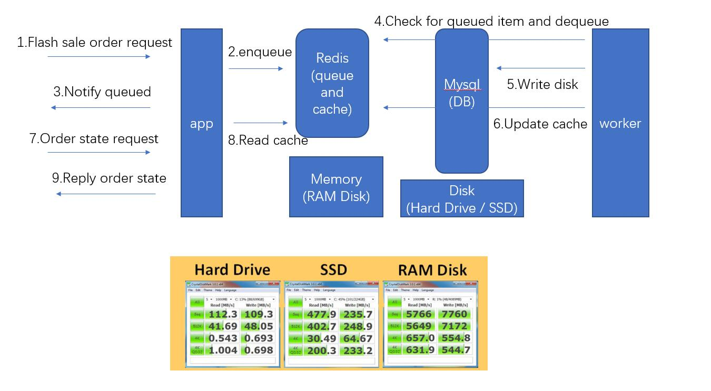

queue example
============================

队列系统演示（模拟处理抢购的高压力场景）| queue system example (mimic flash sale online)



## 部署方法 | deploy

### redis安装 | install redis
https://redis.io/topics/quickstart


### php依赖安装（通过composer） | install php composer 

```
# 可选步骤-更换composer源 https://pkg.phpcomposer.com/ | optional, change composer source
php composer.phar config -g repo.packagist composer https://packagist.phpcomposer.com 

# 安装 yii2-queue | install yii2-queue
php composer.phar require --prefer-dist zhuravljov/yii2-queue
```

### 配置redis、mysql及队列 | config redis, mysql and queue

refer

- [config/web.php](./config/web.php)
- [config/console.php](./config/console.php)

## 压测方法 | stress test

### 启动web服务 | start web server

```
./yii serve
```

默认服务地址：http://localhost/index.php
如果配置到其他地址，需要更改\项目目录\vegeta.urls.txt中的内容

初始化redis，注意安web配置更改相应地址
http://localhost/index.php?r=site/store&add=100


### 启动worker

打开两个cmd窗口，分别执行

```
yii queue/listen
```

```
yii queue-chained/listen
```


### vegeta安装
vegeta下载：https://github.com/tsenart/vegeta/releases
将vegeta.exe放到项目目录即可

### 启动压测命令
```
cd \项目目录\
stress
```

## 多通道（queue-chained）

业务中有部分逻辑需要跑在win平台，或者docker内部，就需要将这一部分任务推到单独的队列中
需要注意的是redis默认只能被本机访问，需要放开局域网访问权限，如果觉得不安全就加个密码验证吧


## yii2-queue
refer https://github.com/zhuravljov/yii2-queue